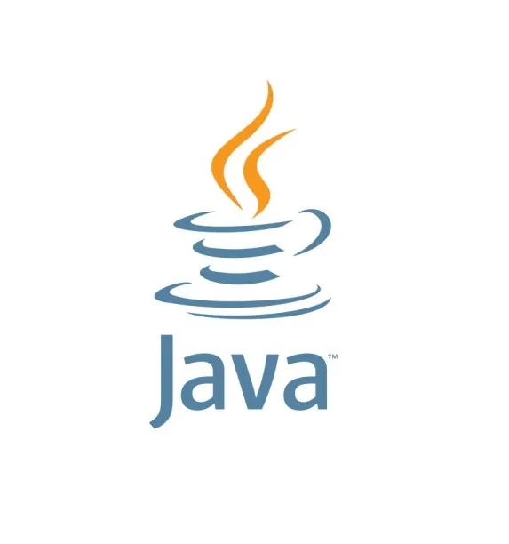

# Java: Pi4J IoT (Internet of things)



In the preceding article, we provided a concise overview of Java’s role within the IoT landscape, delving into the advantages it brings to the table and the potential drawbacks associated with its use in IoT development.

Expanding on the discussion, Java’s significance in the IoT sphere stems from its versatility and extensive ecosystem. Its platform independence allows Java applications to run seamlessly across various hardware platforms, a crucial aspect in the heterogeneous IoT environment. Furthermore, Java’s robustness, scalability, and support for multithreading make it well-suited for handling the diverse requirements of IoT deployments, from sensor data processing to cloud integration.

Despite these strengths, Java in IoT isn’t without its challenges. Some argue that Java’s memory footprint may be larger compared to lower-level languages, potentially impacting resource-constrained IoT devices. Additionally, concerns regarding real-time performance and latency may arise in applications where timing constraints are critical.

Nevertheless, Java’s benefits often outweigh these drawbacks, especially in scenarios where rapid development, maintainability, and interoperability are paramount. Its extensive library support, active community, and mature tooling further solidify its position as a top choice for IoT developers leveraging the power of Java in their projects.

### Pi4J


In our previous article, we explored a selection of examples showcasing the capabilities of Pi4J, a library renowned for its seamless integration with IoT development on Raspberry Pi. These examples served as a practical demonstration of Pi4J’s ability to provide a smooth introduction to IoT, offering developers a straightforward yet powerful means to interact with GPIO pins and peripherals.

Moreover, Pi4J’s appeal extends beyond its ease of use. By abstracting the complexities of low-level hardware interactions, Pi4J enables developers to focus on implementing their application logic rather than grappling with intricate hardware details. This abstraction layer not only simplifies the development process but also enhances code readability and maintainability.

Additionally, Pi4J’s compatibility with a wide range of sensors, actuators, and displays, combined with its rich feature set encompassing digital and analog I/O, PWM, and communication protocols like I2C and SPI, makes it a versatile tool for IoT projects of varying complexities.

By providing a smooth transition from theory to practice, Pi4J empowers developers to quickly prototype and iterate on their IoT ideas, facilitating rapid innovation in the IoT space. Its intuitive API, extensive documentation, and active community support further bolster its appeal as a go-to choice for IoT enthusiasts and professionals alike.

Pi4J offers several benefits that make it a valuable tool for GPIO programming on Raspberry Pi:

Simplicity: Pi4J provides a straightforward and easy-to-use Java API for interacting with GPIO pins, making it accessible to developers of all skill levels. Its intuitive syntax and clear documentation simplify the process of GPIO programming.
Abstraction: Pi4J abstracts low-level details of GPIO interactions, allowing developers to focus on their application logic rather than dealing with hardware-specific nuances. This abstraction enhances code readability and maintainability.
Platform Independence: Java is a platform-independent language, and Pi4J inherits this characteristic. Applications developed with Pi4J can run on any platform that supports Java, providing flexibility and portability across different environments.
Rich Feature Set: Pi4J offers a rich set of features for GPIO programming, including digital input/output, analog input, PWM (Pulse Width Modulation), I2C, SPI, and more. It supports a wide range of sensors, actuators, displays, and other peripherals commonly used in IoT projects.
Integration with Java Ecosystem: Pi4J seamlessly integrates with the vast Java ecosystem, allowing developers to leverage existing libraries, frameworks, and tools for IoT development. This integration enables developers to use familiar tools and techniques to build complex IoT applications.
Community Support: Pi4J benefits from a vibrant and active community of developers who contribute to its development, share knowledge, and provide support through forums, documentation, and tutorials. This community-driven approach ensures ongoing improvement and support for the Pi4J library.
Compatibility with Raspberry Pi Models: Pi4J is compatible with various models of Raspberry Pi, from the older models to the latest ones. This compatibility ensures that developers can use Pi4J for their projects regardless of the Raspberry Pi model they are working with.
Open Source: Pi4J is an open-source project released under the Apache License 2.0, allowing developers to use, modify, and distribute the library freely. Its open nature encourages collaboration, innovation, and contribution from the community.
Overall, Pi4J simplifies GPIO programming on Raspberry Pi, offering a robust and flexible solution for building IoT projects in Java. Its simplicity, abstraction, compatibility, and rich feature set make it a preferred choice for developers looking to explore hardware programming with Raspberry Pi and Java.

LCD display usage with Pi4J
An example of how to use Pi4J to interface with an LCD display on Raspberry Pi:

All Maven dependencies were described in the preceding article.


````java
import com.pi4j.component.lcd.impl.I2CLcdDisplay;
import com.pi4j.io.i2c.I2CBus;
import com.pi4j.io.i2c.I2CFactory;
import com.pi4j.util.StringUtil;

import java.io.IOException;

public class LCDExample {

    public static void main(String[] args) throws IOException, I2CFactory.UnsupportedBusNumberException {
        // Define I2C bus number
        int busNumber = I2CBus.BUS_1;

        // Define LCD display properties
        int displayRows = 2;
        int displayColumns = 16;

        // Create LCD display instance
        I2CLcdDisplay lcd = new I2CLcdDisplay(busNumber, 0x27, displayRows, displayColumns);

        // Initialize LCD display
        lcd.init();

        // Clear the display
        lcd.clear();

        // Display text on the LCD
        lcd.write(0, "Hello, Pi4J!");
        lcd.write(1, "LCD Example");

        // Wait for a few seconds
        try {
            Thread.sleep(3000);
        } catch (InterruptedException e) {
            e.printStackTrace();
        }

        // Clear the display
        lcd.clear();

        // Display scrolling text on the LCD
        String scrollingText = "This is a scrolling text example with Pi4J and LCD display.";
        int textLength = scrollingText.length();

        while (true) {
            for (int i = 0; i <= textLength - displayColumns; i++) {
                lcd.write(0, scrollingText.substring(i, i + displayColumns));
                try {
                    Thread.sleep(500);
                } catch (InterruptedException e) {
                    e.printStackTrace();
                }
            }
        }
    }
}
````


Brief description:

We import the necessary Pi4J classes for interfacing with the LCD display and I2C bus.
We create an instance of I2CLcdDisplay with the I2C bus number and the address of the LCD display (0x27 by default).
We initialize the LCD display and clear it to ensure a clean start.
We write static text to the LCD display, demonstrating how to display fixed content.
We wait for a few seconds before clearing the display again.
We display scrolling text on the LCD display, demonstrating how to animate text on the display.
Make sure you have the necessary hardware connected (I2C LCD display) and the Pi4J library installed on your Raspberry Pi. Then compile and run the Java code on your Raspberry Pi to see the LCD display in action!

