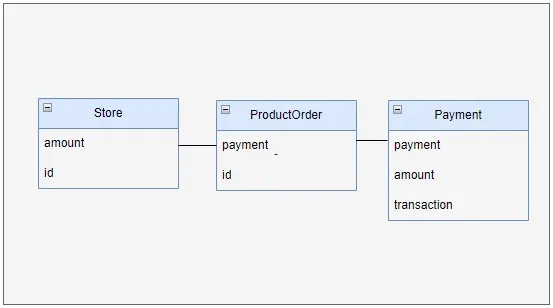
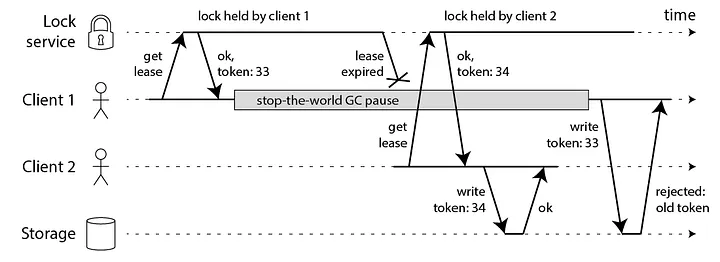

# Unlocking the Power of Global Locks. A Java and Spring Perspective

### A Java and Spring Perspective

In the realm of concurrent programming, managing shared resources efficiently and safely is paramount. One of the fundamental tools for achieving this is the global lock. In this article, we delve into the world of global locks from the perspective of Java and Spring developers. We’ll explore what global locks are, why they’re essential, and how they can be implemented effectively within Java applications, particularly within the context of the Spring framework. By understanding the principles and practices surrounding global locks, developers can unlock greater performance and reliability in their concurrent applications.


### Example

Imagine a straightforward product purchasing scenario. The user is required to choose 2–3 items from a vast array of products, place an order, and furnish payment details. The server undertakes validation tasks, such as verifying the availability of the chosen product in stock. Subsequently, it executes the purchase transaction.

In this case, it’s necessary to synchronize the reduction of product inventory with the deduction of funds from the bank card. Herein lay the issue: when dozens, hundreds of users visited the site, it turned out that all of them successfully passed validation before the product inventory decreased.

The design of database tables:



Table Store encompasses all available products for purchase, each identified by a primary key, id.

Within Table Payment, the outcomes of completed purchases are stored. Here, payment serves as the primary key, amount denotes the total cost of the acquired products, and transaction represents the attribute transmitted by the bank.

Table ProductOrder establishes a 1:N relationship between Store and Payment, indicating that a single payment may correspond to multiple product purchases.

We have such sequence of actions to buy some products:

- We check availability of product the store before proceeding with the purchase. Verifies if the Product with the specified id is available in the store and if its amount is greater than 1 (indicating availability).
- Than we insert the payment transaction details, including the total amount paid and the transaction information into Payment table.
- Next we need, associate a payment transaction with one or more products purchased, indicating the products included in the order. Responsible for this is PaymentOrder table. We insert a new order record into the ProductOrder table.
- And finally we decreases the quantity of the purchased product in the store inventory. And we need to update the inventory amount of a product in the Store table after a purchase.


Validation involves a straightforward query: SELECT 1 FROM Store WHERE id= ? AND amount > 1. This way, we verify if the product items is available in stock. Next, we create a “payment” entry in the Payment table, add a new record to the ProductOrder table, and in the final line of code, decrement the quantity of product instances in stock by one.

```java
public class ProductService {

    private final JdbcTemplate jdbcTemplate;

    public void buyProducts(List<Product> products, Payment userPayment) {

        // execute check "SELECT 1 FROM Store WHERE id = ? AND amount > 1";
        // execute insert payment "INSERT INTO Payment (amount, transaction) VALUES ...";
        // execute insert order "INSERT INTO ProductOrder (payment, product_id) VALUES ..."
        // execute store update "UPDATE Store SET amount = amount - 1 WHERE id = ?"


        final String checkSql =
                "SELECT 1 FROM Store WHERE id = ? AND amount > 1";
        //jdbcTemplate...
        final String insertPaymentSql =
                "INSERT INTO Payment (amount, transaction) VALUES ...";
        //jdbcTemplate...
        final String insertOrderSql =
                "INSERT INTO ProductOrder (payment, product_id) VALUES ...";
        //jdbcTemplate...
        final String updateStoreSql =
                "UPDATE Store SET amount = amount - 1 WHERE id = ?";
        //jdbcTemplate...
    }
}
```

For this task we have few approaches to solve this.

- Spring @ Transactional.
- Database lock.
- Spring Global Lock.
  Solution with Transaction annotation

```java
For this task we have few approaches to solve this.

Spring @ Transactional.
Database lock.
Spring Global Lock.
Solution with Transaction annotation
```

But this will not help, and let me explain a bit how transactions are organized:

- Read committed: In this isolation level, a transaction reads only committed data (from completed transactions). This isolation level is used by default in most existing databases (Oracle, SQL, MySQL, etc.). It provides an optimal balance between performance and isolation but is susceptible to phenomena like phantom reads.
- Serializable: This isolation level ensures data non-interference. However, a drawback is increased user waiting time in queues.

But for such case even update will not help, because we have UPDATE:

```java
"UPDATE Store SET amount = amount - 1 WHERE id = ?"
```

Even when performed within a transaction, the validation reads read-only data. These data effectively return a result indicating that the product item is available in stock. Subsequently, the remaining business logic may operate under the assumption of an empty inventory, as the product item may have already been purchased by another user.

### Using database

In databases, there are lock modes used to control concurrent access to data. When using the em.find(id, LockMode.PESSIMISTIC_READ) method in JPA (Java Persistence API), you’re indicating that you want to retrieve an entity by its identifier (in this case, by id) and apply a pessimistic read lock on it.

- em.find(id, LockMode.PESSIMISTIC_READ): This method is typically used to retrieve an entity by its primary key or identifier. em refers to the entity manager, which is part of the JPA framework. Id is the identifier used to retrieve the entity. LockMode.PESSIMISTIC_READ is an enum constant indicating the type of lock mode to be applied to the entity.
- LockMode.PESSIMISTIC_READ: This lock mode indicates a pessimistic locking strategy where a read lock is obtained on the entity. Pessimistic locking prevents other transactions from modifying the entity until the lock is released. With LockMode.PESSIMISTIC_READ, other transactions can still read the entity but cannot obtain a write lock on it until the lock is released.

But this is not solution also. There are several criticisms even for this code.

Let’s examine the purchase process step by step:

- The user requests the availability of a product item.
- The server validates the data and confirms that the product item is purchasable.
- Permission is granted to proceed with the transaction.

Now, let’s consider what will happen if obtaining confirmation from the bank takes more than 1 minute (the timeout period set for transaction termination in most databases by default).

### Spring Global Lock
Spring Global Lock will solve this problem.

Maven dependency:

```java
<dependency>
    <groupId>org.springframework.boot</groupId>
    <artifactId>spring-boot-starter-integration</artifactId>
</dependency>
<dependency>
    <groupId>org.springframework.integration</groupId>
    <artifactId>spring-integration-core</artifactId>
</dependency>
```

Here code:

```java
import org.springframework.beans.factory.annotation.Autowired;
import org.springframework.stereotype.Service;
import org.springframework.transaction.annotation.Transactional;
import org.springframework.integration.support.locks.LockRegistry;
import java.util.List;
import java.util.concurrent.locks.Lock;

@Service
public class ProductService {

    @Autowired
    private LockRegistry lockRegistry;

    @Transactional
    public void buyProducts(List<Product> products, Payment userPayment) {
        for (Product product : products) {
            Lock lock = lockRegistry.obtain(product.getId());
            lock.lock(); // lock.tryLock();
            try {
                doInsertAndUpdate(product);
            } catch (InterruptedException e) {
                //give up
                Thread.currentThread().interrupt();
            } finally {
                lock.unlock();
            } //try
        } //for
    }
    
    private void doInsertAndUpdate(Product product) throws InterruptedException {
        // Insert and update logic goes here
    }
}
```

As you can see, we have achieved a simple and concise code, ensuring the absence of issues.

The key getId in the code allows pinpoint locking of only the necessary product item. It doesn’t matter what you use as the key for Spring: you can specify a global identifier to lock the entire system or a specific Id to lock a single record. Spring accepts any Object, which will be used as the key.

In the standard Spring library, LockRegistry of SpringLock offers five primary implementation options:

- PassThruLockRegistry.
- GemfireLockRegistry.
- RedisLockRegistry.
- JdbcLockRegistry.
- ZookeeperLockRegistry.

Detail description:

- PassThruLockRegistry: This implementation is a simple no-op registry that does not actually perform locking. It’s mainly used for testing or scenarios where locking is not required.
- GemfireLockRegistry: This implementation utilizes Apache Geode (formerly known as Pivotal GemFire), a distributed data management platform, for locking. It provides distributed locking capabilities suitable for clustered environments.
- RedisLockRegistry: RedisLockRegistry uses Redis, an in-memory data structure store, as a distributed lock manager. It leverages Redis’s atomic operations to achieve distributed locking across multiple instances of an application.
- JdbcLockRegistry: JdbcLockRegistry stores lock information in a relational database using JDBC. It allows applications running in a clustered environment to synchronize access to shared resources using a database as the coordination mechanism.
- ZookeeperLockRegistry: it utilizes Apache ZooKeeper, a distributed coordination service, for distributed locking. ZooKeeper provides reliable distributed coordination primitives, making it suitable for implementing distributed locks in large-scale systems.

Each of these implementations offers different trade-offs in terms of performance, scalability, and complexity, allowing developers to choose the one that best fits their specific requirements and environment.

JdbcLockRegistry is the most common and widely used instance, which is worth exploring further. For its implementation, Spring introduces an auxiliary table into the existing database. For each lock in this table, a new record is created with a key specified by the programmer. If a similar key exists in the database, Spring determines that locking is not possible.

But what happens if a record of locking is made in the database, and the code that initiated the transaction was intentionally closed by the user or terminated due to an error? Naturally, no one else will be able to lock this key anymore. To address such situations, developers have introduced the “when” field. This field allows us to limit our transaction by time.

However, even the presence of the “when” field does not save us from another problem. Let’s consider a diagram taken from Martin Kleppmann’s article.



The Lock table in this case implements the JdbcLockRegistry.

- Client 1 acquires and holds the lock for an extended period (for instance, if the client’s Garbage Collector kicks in at some point, causing a slowdown in the Java application).
- The locking service monitors the occurrence of a timeout using the “when” field and cancels the lock. So far, everything is correct.
- Enter Client 2. It takes over the lock, successfully completes its own business transaction.
- Then, Client 1’s Garbage Collector finishes its work, and Client 1 successfully writes its data to the database just like before.

As result all data of Client 2 transaction were lost.

To resolve such situations, an integer field called “version” is added to the JdbcLockRegistry.

- At the moment when the transaction is captured, Client 1 receives a token (in the example on the picture, it’s 33).
- Client 2 enters the scene. It captures the lock after the lock is released, and it is given token 34. Client 2 writes data.
- Client 1’s Garbage Collector wakes up, but when Client 1 tries to perform any actions with the database, it turns out that the outdated token 33 conflicts with token 34. As a result, Client 1 receives an error.

Such code with the “when” and “version” fields ensures correct business behavior in complex distributed scenarios.

Now let’s pay a little more attention to the implementation of ZookeeperLockRegistry.


Apache Zookeeper is a hierarchical distributed information store. It’s not a database but can be used as one (although it’s not entirely convenient). Zookeeper is actively used in implementing large distributed systems, and for example, the widely known Apache Kafka stores important settings such as:

- the list of allowed users;
- who acts as the leader;
- the level of redundancy, etc.

Information in Zookeeper is organized in the form of a tree, where nodes can store any data. Zookeeper is practically an “indestructible” system that raises multiple instances to ensure the required level of information replication. In terms of the CAP theorem, Zookeeper is a typical CP-system (Consistency — Partition Tolerance): it distributes well across the network and guarantees that information will be reliably stored.

Thus, using ZookeeperLockRegistry implies that information about locks will be stored in a distributed hierarchical storage.

Here are the pros and cons of using a global lock in Spring:

Pros:

- Simplified Management: With a global lock, you have a centralized mechanism for managing concurrency across your application. This simplifies the handling of concurrent access to shared resources.
- Ensured Data Integrity: Global locks help prevent race conditions and ensure data integrity by serializing access to critical sections of code or shared resources. This can prevent issues such as data corruption or inconsistent state.
- Compatibility: Spring provides various implementations of global locks that are compatible with different storage systems, such as databases, Redis, ZooKeeper, etc. This flexibility allows you to choose the most suitable option for your application’s requirements and infrastructure.

Cons:

- Performance Overhead: Global locks can introduce performance overhead, especially in high-concurrency environments. Acquiring and releasing locks can add latency to request processing, potentially impacting application performance.
- Potential Deadlocks: Improper usage of global locks can lead to deadlocks, where two or more threads are indefinitely blocked, waiting for each other to release locks. Careful design and implementation are required to avoid such scenarios.
- Scalability Challenges: In distributed systems, managing global locks across multiple nodes can be challenging. Issues such as network latency, node failures, and consistency guarantees need to be carefully considered to ensure scalability and reliability.

Overall, while global locks provide a convenient mechanism for managing concurrency in Spring applications, they should be used judiciously and with careful consideration of their impact on performance, scalability, and potential for deadlocks.

Summary
In summary, using global locks in Spring applications offers several advantages, including simplified concurrency management, ensured data integrity, and compatibility with various storage systems. However, it comes with potential drawbacks such as performance overhead, the risk of deadlocks, and scalability challenges in distributed environments. Therefore, while global locks provide a valuable tool for managing concurrent access to shared resources, careful consideration of their usage and implementation is necessary to mitigate these potential issues and ensure optimal application performance and reliability.
