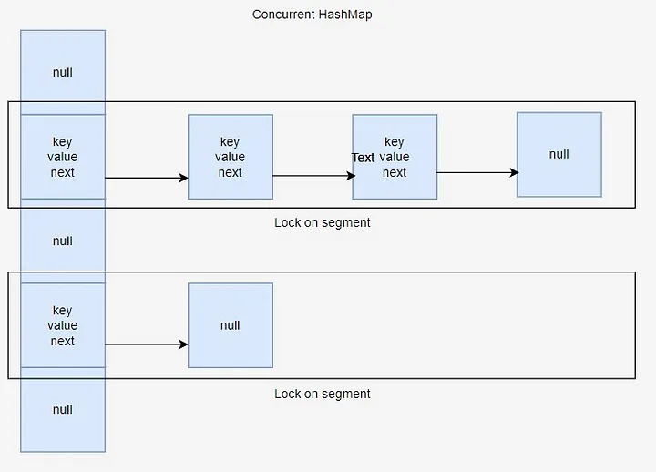

# Unlocking Concurrent Power: A Guide to java.util.concurrent Pt. 1


My other articles of concurrency and multithreading:
[Navigating Java’s Multithreading Terrain Pt. 1. Dining Philosophers](https://medium.com/@alxkm/navigating-javas-multithreading-terrain-dining-philosophers-34f1385e2150)

[Navigating Java’s Multithreading Terrain Pt. 2](https://medium.com/@alxkm/navigating-javas-multithreading-terrain-part-2-fd0d541a973c)

>
HERE[Unlocking Concurrent Power: A Guide to java.util.concurrent Pt. 1](https://medium.com/@alxkm/unlocking-concurrent-power-a-guide-to-java-util-concurrent-pt-1-b1342edadad1)

[Unlocking Concurrent Power: A Guide to java.util.concurrent Pt. 2.](https://medium.com/@alxkm/unlocking-concurrent-power-a-guide-to-java-util-concurrent-pt-2-056f1da1e74a)

Java’s java.util.concurrent package empowers developers with robust tools for effective concurrent programming. From managing threads to synchronizing data access, this package offers a rich set of features to tackle the complexities of parallel execution. In this article, we’ll explore the key components and strategies provided by java.util.concurrent, unlocking the potential for scalable and efficient multi-threaded applications.

Our brief plan for this article:

1. Introduction to java.util.concurrent package
2. Thread management with Executors and ThreadPoolExecutor
3. Synchronization and coordination with locks, conditions, and semaphores
4. Concurrent collections: ConcurrentHashMap, ConcurrentLinkedQueue, etc.
5. Atomic variables and atomic operations
6. Conclusion

### Introduction to java.util.concurrent package

The java.util.concurrent package revolutionized concurrent programming in Java, providing developers with a comprehensive toolkit for building efficient and scalable multi-threaded applications. Introduced in Java 5 (JDK 1.5) as part of JSR 166, this package was developed by Doug Lea and his team, who pioneered the incorporation of advanced concurrency constructs into the Java language.

Before the advent of java.util.concurrent, concurrent programming in Java relied heavily on low-level synchronization primitives such as synchronized blocks and wait/notify mechanisms. While effective, these primitives often led to complex and error-prone code, making it challenging to develop and maintain concurrent applications.

With the introduction of java.util.concurrent, developers gained access to a rich set of high-level abstractions and thread-safe implementations for common concurrency patterns. From thread pools and executors for managing thread lifecycle to concurrent collections like ConcurrentHashMap and ConcurrentLinkedQueue, the package offered a standardized and efficient way to handle concurrent operations.

Moreover, java.util.concurrent introduced atomic variables, locks, and condition objects for fine-grained synchronization, enabling precise control over shared resources and mitigating common concurrency issues such as race conditions and deadlocks.

In this article, we’ll explore the key components of the java.util.concurrent package, highlighting its evolution, core features, and best practices for building robust and scalable concurrent applications.

### Brief structure:


Concurrent Collections are a set of collections that work more efficiently in a multi-threaded environment than the standard universal collections from the java.util package. Instead of the basic Collections.synchronizedList wrapper with blocking access to the entire collection, locks are used on data segments or the work is optimized for parallel reading of data using wait-free algorithms.

Queues — non-blocking and blocking queues with multi-threading support. Non-blocking queues are designed for speed and operation without blocking threads. Blocking queues are used when you need to “slow down” the “Producer” or “Consumer” threads if some conditions are not met, for example, the queue is empty or overflowed, or there is no free “Consumer”.

Synchronizers are auxiliary utilities for synchronizing threads. They are a powerful weapon in “parallel” computing.

Executors — contains excellent frameworks for creating thread pools, scheduling asynchronous tasks and obtaining results.

Locks are alternative and more flexible thread synchronization mechanisms compared to the basic synchronized, wait, notify, notifyAll.

Atomics — classes with support for atomic operations on primitives and references.

Hierarchy for package java.util.conncurrent:


As you see java.util.concurrent package is pretty huge. But we will review the most important things of it.

In Java, managing threads manually can be complex and error-prone. Executors and ThreadPoolExecutor, introduced in the java.util.concurrent package, provide powerful abstractions for thread management, making it easier to control the lifecycle of threads and execute tasks concurrently.

### Executors:

Executors are the central abstraction for managing threads in Java. They decouple the task submission from the thread creation, allowing developers to focus on the logic of the tasks rather than the details of thread management.
Executors provide a variety of factory methods for creating different types of thread pools, such as fixed-size thread pools, cached thread pools, and scheduled thread pools.
Example:

```java
ExecutorService executor = Executors.newFixedThreadPool(5);
executor.submit(() -> {
    // Task logic here
});
executor.shutdown();
```
### ThreadPoolExecutor:

ThreadPoolExecutor is the underlying implementation of the ExecutorService interface, offering fine-grained control over thread pool configuration and behavior.
It allows customization of core pool size, maximum pool size, thread keep-alive time, work queue, and thread factory, among other parameters.
Example:

```java
ThreadPoolExecutor executor = new ThreadPoolExecutor(
    5, // core pool size
    10, // maximum pool size
    60, // keep-alive time for idle threads
    TimeUnit.SECONDS, // time unit for keep-alive time
    new ArrayBlockingQueue<>(100) // work queue
);
executor.execute(() -> {
    // Task logic here
});
executor.shutdown();
```

### Key Features:

* Thread reuse: Executors and ThreadPoolExecutor recycle threads, reducing the overhead of thread creation and destruction.
* Load balancing: ThreadPoolExecutor automatically distributes tasks across threads, optimizing resource utilization.
* Task queuing: ThreadPoolExecutor supports different types of work queues (e.g., bounded queues, unbounded queues, synchronous queues) to manage pending tasks.
* Thread lifecycle management: Executors and ThreadPoolExecutor handle thread lifecycle events such as creation, execution, and termination, simplifying thread management.

Best Practices:

* Choose the appropriate executor configuration based on the application’s requirements and workload characteristics.
* Monitor thread pool metrics such as thread utilization, task queue size, and throughput to optimize performance.
* Properly handle exceptions thrown by tasks to prevent thread starvation and maintain the stability of the thread pool.
* Consider using managed executors like ForkJoinPool for CPU-bound tasks and cached thread pools for I/O-bound tasks.

In summary:

Executors and ThreadPoolExecutor provide powerful tools for managing threads in Java, offering flexibility, scalability, and efficiency in concurrent programming. By leveraging these abstractions, developers can build responsive and scalable applications while abstracting away the complexities of low-level thread management.

### Synchronization and coordination with locks, conditions, and semaphores


In multi-threaded applications, proper synchronization and coordination are essential to ensure thread safety and avoid data races. Java’s java.util.concurrent package provides several mechanisms for achieving synchronization and coordination, including locks, conditions, and semaphores.

### Locks:

* Locks are fundamental synchronization primitives used to control access to shared resources by multiple threads.
* Java provides the ReentrantLock class, which implements the Lock interface, allowing exclusive access to a resource by acquiring and releasing the lock.

Example:

```java
ReentrantLock lock = new ReentrantLock();
lock.lock();
try {
    // Critical section
} finally {
    lock.unlock();
}
```

Conditions:

* Conditions are associated with locks and allow threads to wait for a specific condition to become true before proceeding.
* Conditions are created using the newCondition() method of the Lock interface.

Example:

```java
import java.util.concurrent.locks.Condition;
import java.util.concurrent.locks.Lock;
import java.util.concurrent.locks.ReentrantLock;

public class ConditionExample {
    private final Lock lock = new ReentrantLock();
    private final Condition condition = lock.newCondition();
    private boolean conditionMet = false;

    public void awaitCondition() {
        lock.lock();
        try {
            while (!conditionMet) {
                condition.await();
            }
            // Continue execution after condition is met
            System.out.println("Condition met, continuing execution.");
        } catch (InterruptedException e) {
            Thread.currentThread().interrupt(); // Handle interrupt appropriately
        } finally {
            lock.unlock();
        }
    }

    public void signalCondition() {
        lock.lock();
        try {
            conditionMet = true;
            condition.signal(); // Signal the waiting thread
        } finally {
            lock.unlock();
        }
    }

    public static void main(String[] args) {
        ConditionExample example = new ConditionExample();

        // Create a thread to wait for the condition
        Thread waitingThread = new Thread(example::awaitCondition);
        waitingThread.start();

        // Simulate some work before signaling the condition
        try {
            Thread.sleep(2000); // Simulate work
        } catch (InterruptedException e) {
            Thread.currentThread().interrupt(); // Handle interrupt appropriately
        }

        // Signal the condition from the main thread
        example.signalCondition();
    }
}
```
Condition Waiting Thread:
* The awaitCondition method waits for conditionMet to become true. It acquires the lock, enters the while loop to await the condition, and continues execution once the condition is met.
* condition.await() is used to release the lock and wait for a signal, reacquiring the lock upon wake-up.
 
Condition Signaling Thread:
* The signalCondition method sets conditionMet to true and signals the condition. This wakes up any thread waiting on the condition.
* condition.signal() or condition.signalAll() is used to notify the waiting thread(s).

Main Method:

* Demonstrates how to start the waiting thread and simulate some work before signaling the condition.
* Ensures that the waiting thread starts first, then the main thread signals the condition after a delay.
* 
By following this pattern, you can ensure proper synchronization and coordination between threads using Condition objects in Java.
### Semaphores:

* Semaphores are used to control access to a shared resource with a limited number of permits.
* Java provides the Semaphore class, which allows threads to acquire and release permits.

Example:

```java
Semaphore semaphore = new Semaphore(5); // permits = 5
semaphore.acquire(); // Acquire a permit
try {
    // Access shared resource
} finally {
    semaphore.release(); // Release the permit
}
```

Key Features:

* Locks provide exclusive access to shared resources, preventing concurrent modification and ensuring thread safety.
* Conditions enable threads to wait for specific conditions to be met before proceeding, facilitating thread coordination and synchronization.
* Semaphores control access to shared resources with limited capacity, allowing a fixed number of threads to access the resource concurrently.
* These synchronization primitives are essential for building robust and scalable concurrent applications while avoiding race conditions, deadlocks, and livelocks.

### Best Practices:

* Use locks, conditions, and semaphores judiciously to minimize contention and maximize concurrency.
* Always release locks and permits in finally blocks to ensure proper cleanup and avoid resource leaks.
* Consider using higher-level abstractions like ConcurrentHashMap and ConcurrentLinkedQueue for thread-safe data structures instead of manual synchronization with locks.

### In summary:

Synchronization and coordination with locks, conditions, and semaphores are critical for building reliable and efficient multi-threaded applications in Java. By leveraging these synchronization primitives effectively, developers can ensure thread safety, prevent data corruption, and achieve optimal performance in concurrent programming scenarios.

### Concurrent collections
Java’s java.util.concurrent package provides a variety of thread-safe collections designed for concurrent access by multiple threads. These concurrent collections offer efficient and scalable data structures for use in multi-threaded applications, ensuring thread safety without the need for explicit synchronization.


### ConcurrentHashMap:

* ConcurrentHashMap is a high-performance concurrent hash table implementation, providing thread-safe access to key-value pairs.
* Unlike traditional HashMap, ConcurrentHashMap allows concurrent reads and writes from multiple threads without blocking.
* It achieves this by partitioning the hash table into segments, each guarded by a separate lock, allowing concurrent updates to different segments.



Example:

```java
ConcurrentHashMap<String, Integer> map = new ConcurrentHashMap<>();
map.put("key", 123);
int value = map.get("key");
```

### ConcurrentLinkedQueue:

* ConcurrentLinkedQueue is a concurrent implementation of the Queue interface, providing thread-safe access to a linked list of elements.
* It supports high-concurrency scenarios with non-blocking operations for both insertion and removal of elements.
* ConcurrentLinkedQueue achieves thread safety by using lock-free algorithms and atomic operations, ensuring efficient and scalable performance.

Example:

```java
ConcurrentLinkedQueue<String> queue = new ConcurrentLinkedQueue<>();
queue.offer("element1");
String element = queue.poll();
```

### CopyOnWriteArrayList:

* CopyOnWriteArrayList is a thread-safe variant of ArrayList, where all mutative operations (add, set, remove) are implemented by making a fresh copy of the underlying array.
* It provides thread safety for concurrent reads and writes without blocking, making it suitable for scenarios where reads outnumber writes.
* CopyOnWriteArrayList is ideal for situations where the collection is mostly read-only or where concurrent modifications are infrequent.

Example:

```java
CopyOnWriteArrayList<String> list = new CopyOnWriteArrayList<>();
list.add("element1");
String element = list.get(0);
```

### BlockingQueue Implementations:

* Java’s java.util.concurrent package also provides several blocking queue implementations, such as LinkedBlockingQueue and ArrayBlockingQueue, which offer blocking operations for producer-consumer scenarios.
* These blocking queues support concurrent insertion and removal operations, with blocking behavior when the queue is empty or full.

Example:

```java
BlockingQueue<String> queue = new LinkedBlockingQueue<>();
queue.put("element1"); // Blocking operation if queue is full
String element = queue.take(); // Blocking operation if queue is empty
```

### Key Features:

* Thread safety: Concurrent collections ensure safe access to shared data structures in multi-threaded environments without the need for explicit synchronization.
* Scalability: These collections are designed to scale well with increasing numbers of threads, minimizing contention and maximizing concurrency.
* Performance: Concurrent collections leverage efficient algorithms and data structures to achieve high performance in concurrent scenarios, reducing overhead and contention.

### In summary:

Concurrent collections such as ConcurrentHashMap, ConcurrentLinkedQueue, and CopyOnWriteArrayList are essential tools for building thread-safe and scalable concurrent applications in Java. By providing efficient and scalable data structures for concurrent access, these collections simplify multi-threaded programming and enable developers to build robust and efficient applications with ease.

### Conclusion

In conclusion, the exploration of Java’s java.util.concurrent package and its associated tools provides a holistic understanding of modern concurrent programming paradigms. From the foundational elements of thread management with Executors and ThreadPoolExecutor to the intricate mechanisms of synchronization and coordination using locks, conditions, and semaphores, developers gain a comprehensive toolkit for managing concurrent execution.

Moreover, the study of concurrent collections like ConcurrentHashMap and ConcurrentLinkedQueue demonstrates the importance of efficient and thread-safe data structures in concurrent environments. These collections offer scalable solutions for sharing data among multiple threads while minimizing contention and maximizing performance.

Additionally, the discussion on atomic variables and atomic operations underscores the significance of thread-safe operations without the overhead of locks or synchronized blocks. By leveraging atomic constructs, developers can achieve fine-grained synchronization and ensure consistency in shared variable access, enhancing both concurrency and performance.

Collectively, these topics illustrate the versatility and robustness of Java’s concurrency utilities, empowering developers to build scalable, responsive, and efficient multi-threaded applications. With a deep understanding of these concepts and tools, developers can navigate the complexities of concurrent programming with confidence, effectively harnessing the power of parallelism while mitigating common pitfalls and ensuring thread safety.

