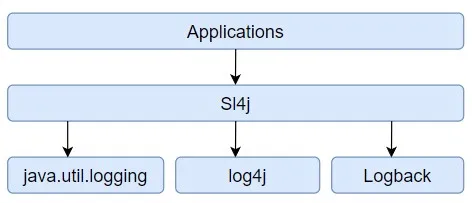

# Fundamentals of Logging in Java Applications
## 
Logging plays a crucial role in modern Java applications, serving as a important component for monitoring and troubleshooting. In this article, we’ll delve into key aspects of logging that are essential for applications smooth operation and maintenance. This topic holds significant importance in ensuring the reliability and efficiency of applications.



### Choose a Logging Framework

Java offers several logging frameworks like Log4j, Logback, and java.util.logging. Choose one based on your requirements and preferences.

### Add Dependency

Than we need to choose dependency. If you’re using a third-party logging framework like Log4j or Logback, you’ll need to add the corresponding dependency to your project’s build configuration (e.g., Maven or Gradle).

When using a third-party logging framework such as Log4j or Logback in your Java project, you must include the necessary dependency in your project’s build configuration. This is typically done using dependency management tools like Maven or Gradle, which handle the downloading and inclusion of external libraries into your project.

Maven:

In your project’s pom.xml file, you'll need to add a dependency entry for the logging framework you want to use. For example, if you're using Log4j 2.x, you would add something like this within the <dependencies> section:


```java
<dependency>
<groupId>org.apache.logging.log4j</groupId>
<artifactId>log4j-core</artifactId>
<version>2.23.1</version> <!-- Or the latest version -->
</dependency>
```

Replace the version number with the version you want to use, or specify the latest version to always use the most recent release.

### Gradle:

If you’re using Gradle, you’ll need to add the dependency to your build.gradle file. For Log4j 2.x, it would look something like this:

```java
dependencies {
        implementation 'org.apache.logging.log4j:log4j-core:2.23.1' // Or the latest version
        }
```

As with Maven, make sure to specify the version number you want to use, or use latest.release to always use the latest available version.

After adding the dependency and saving the build configuration file, Maven or Gradle will automatically download the required logging framework library and include it in your project’s classpath, allowing you to use its functionality in your Java application.

This step is crucial as it ensures that your project has access to the logging framework’s classes and methods, enabling you to effectively implement logging within your Java application.

### Configure Logging

Set up the logging framework by configuring its properties. This includes specifying log levels, output destinations (e.g., console, file), log format, and any other relevant settings. This is often done through configuration files like log4j.properties or logback.xml.

### Basic config:

```java
<?xml version="1.0" encoding="UTF-8"?>
<Configuration status="WARN">
<Appenders>
<Console name="Console" target="SYSTEM_OUT">
<PatternLayout pattern="%d{HH:mm:ss.SSS} [%t] %-5level %logger{36} - %msg%n"/>
</Console>
</Appenders>
<Loggers>
<Root level="debug">
<AppenderRef ref="Console"/>
</Root>
</Loggers>
</Configuration>
```


This configuration sets up a simple console appender that prints log messages with a timestamp, thread name, log level, logger name, and the message itself.


### Use Logging Levels
```java
import org.apache.logging.log4j.LogManager;
import org.apache.logging.log4j.Logger;

public class Application {
private static final Logger logger = LogManager.getLogger(MyApp.class);

    public static void main(String[] args) {
        logger.debug("Debug message");
        logger.info("Info message");
        logger.warn("Warning message");
        logger.error("Error message");
    }
}
```


Throughout your application, use the logger instance to log messages at different log levels (DEBUG, INFO, WARN, ERROR, etc.). Log messages will be output according to the configuration defined in the Log4j configuration file. Utilize different logging levels (e.g., DEBUG, INFO, WARN, ERROR) appropriately in your code to provide different levels of detail in log messages. This helps in filtering and managing log output effectively.

### Write Log Messages

Insert logging statements at relevant points in your code to capture important events, errors, and information during application execution. Log messages can include contextual information to aid in troubleshooting and debugging.

### Handle Exceptions

Implement exception handling in your code to catch and log exceptions gracefully. Logging exceptions along with relevant details such as stack traces can assist in diagnosing and resolving issues.

Here’s what it entails:

Try-Catch Blocks: In Java, you use try-catch blocks to handle exceptions. The code that might potentially throw an exception is placed within the try block, and the corresponding exception-handling code is placed within the catch block. By implementing exception handling, you ensure that your program doesn’t abruptly terminate when an error occurs, but instead provides a graceful response.

Logging Exceptions: When an exception occurs, logging it means recording details about the error. This includes information like the type of exception, the location in the code where it occurred, and the stack trace, which shows the sequence of method calls leading up to the exception. Logging these details helps developers diagnose and troubleshoot issues effectively.

Graceful Handling: Exception handling allows your program to respond gracefully to errors. Instead of crashing, it can log the error, provide a helpful message to the user (if applicable), and potentially take corrective action or gracefully terminate the program if necessary.

### Review and Maintain

Regularly review and refine your logging configuration and log messages to ensure they meet the evolving needs of your application. Monitor log outputs to identify and address any anomalies or issues in the application’s behavior.

Thanks for reading.
